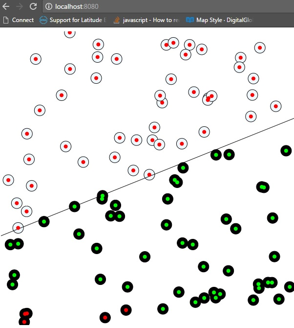

# An attempt to build a basic perceptron using supervised learning.

This example for binary classification is not of great practical use but helps one understand the moving parts in Neural Network based ML. 

Note: This is a Javascript version of the perceptron that Daniel Shiffman created in java in one of his fun videos.

Steps:

1. Install NodeJs
2. Move to the folder where you have downloaded this repo.
3. Run "npm http-server"
4. You should be able to see results in http://localhost:8080

The Green dots are the ones correctly classified and red are wrongly classified. One round of training is done per mouse click. You can see that Perceptron improves its accuracy with each subsequent click.

